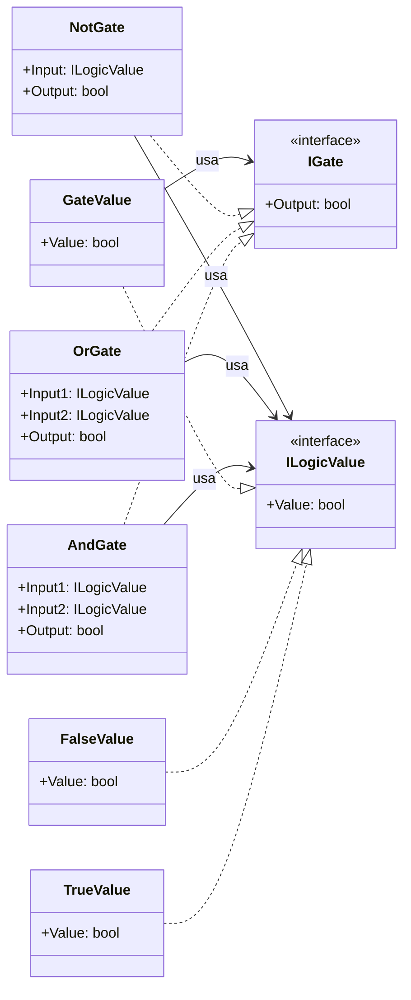

```mermaid
classDiagram
    direction LR

    class ILogicValue {
        <<interface>>
        +Value: bool
    }

    class IGate {
        <<interface>>
        +Output: bool
    }

    class AndGate {
        +Input1: ILogicValue
        +Input2: ILogicValue
        +Output: bool
    }

    class OrGate {
        +Input1: ILogicValue
        +Input2: ILogicValue
        +Output: bool
    }

    class NotGate {
        +Input: ILogicValue
        +Output: bool
    }

    class GateValue {
        +Value: bool
    }

    class TrueValue {
        +Value: bool
    }

    class FalseValue {
        +Value: bool
    }

    AndGate ..|> IGate
    OrGate ..|> IGate
    NotGate ..|> IGate

    TrueValue ..|> ILogicValue
    FalseValue ..|> ILogicValue
    GateValue ..|> ILogicValue

    AndGate --> ILogicValue : usa
    OrGate --> ILogicValue : usa
    NotGate --> ILogicValue : usa
    GateValue --> IGate : usa
```